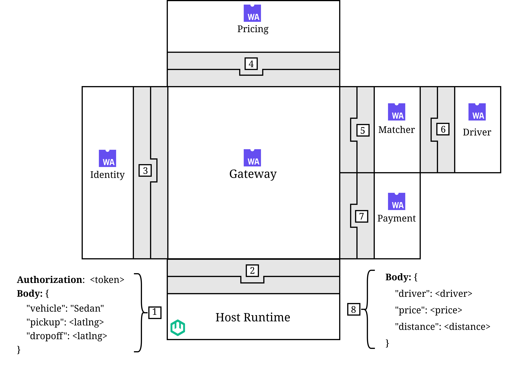

# nebula/demo

A demonstration application for the [nebula](../README.md) automatic instrumentation tool. It consists of a simple **ride hailing application** consisting of six statically WebAssembly components `gateway`, `identity`, `pricing`, `matcher`, `driver` and `pricing`.

## Architecture



All components import `wasi:otel/tracing@0.2.0-rc.3` and are composed together with `wac`. The composed binary is served by a WASM runtime that provides the `wasi:otel` host implementation.

1. A `POST` request with a ride request body and authorization header is sent to the **runtime host** over HTTP.
2. **Runtime host** to **gateway component**
   Invokes `haandle` on `wasi:http/incoming-handler`. The gateway parses the request body and authorization header for further processing.
3. **Gateway component** to **identity component**
   Invokes `check` on `wasmlens:demo/identity` with the authorization header. The identity component validates the JWT token and returns either a user ID or an error.
4. **Gateway Component** to **pricing component**
   Invokes `calculate` on `wasmlens:demo/pricing` with the user ID and ride request body. The pricing component computes a tentative price based on the vehicle type and the distance between the `pickup` and `dropoff` locations, and returns the price.
5. **Gateway component** to **matching component**
   Invokes `find` on `wasmlens:demo/matching` with the user ID, ride request body, and price. It tries to find a driver with the same vehicle type and withing the shortest distance from the pickup location, an returns a candidate driver.
6. **Matching component** to **payment component**
   Invokes `check` on `wasmlens:demo/driver` with a candidate driver, the ride request body, and price. The driver component evaluates the driver’s preferences (distance, price, and other factors) and returns a boolean indicating acceptance. This step repeats until a driver accepts the ride, or no driver was found for the ride request.
7. **Gateway component** to **payment component**
   Invokes `generate-payment-url` on `wasmlens:demo/payment` with the user ID and price. The payment component processes the payment request and returns a payment URL.
8. **Gateway component** to **runtime host** to **client**
   The gateway serializes the response and returns it to the runtime host, which forwards it to the client.

### Build

All individual components already contain hand-written `wasi:otel` spans, which can be enabled or disabled through a feature flag (see the Makefile).

**Prerequisities**:

1. Install `wasm-pkg-tools` (`wkg`)
2. The rust toolchain (via `rustup`)
3. Add namespace registries to the `wkg` config file (often under `$HOME/.config/wasm-pkg/config.toml`):

   ```
   [package_registry_overrides]
   "wasi:otel" = { registry = "ewoutv", metadata = { preferredProtocol = "oci", oci = { registry = "ghcr.io", namespacePrefix = "EwoutV/" } } }
   ```

Manual tracing enabled (every component creates its own span in the source code):

```
make fetch
make build-instrumented
```

No tracing whatsoever (disabled by feature flag):

```
make fetch
make build-uninstrumented
```

### Compose components

```
make compose
```

### Run

Needs the modified `wash` runtime included as a submodule:

1. Navigate to ../deps/wasmCloud
2. Run `cargo install --path crates/wash`

```
wash dev
```

See ./.wash/config.yaml for dev server config of wasmCloud's `wash` command.

### Benchmarks

Three configurations are benchmarked against each other:

| Configuration         | Description                                         |
| --------------------- | --------------------------------------------------- |
| **No tracing**        | Components compiled without any `wasi:otel` imports |
| **Manual tracing**    | Developer-written spans as seen in this demo        |
| **Automatic tracing** | Nebula-generated proxy component                    |

## Observability stack

The demo uses the [.NET Aspire standalone dashboard](https://learn.microsoft.com/en-us/dotnet/aspire/fundamentals/dashboard/standalone) container as the local observability host. It provides distributed tracing, metrics, and structured logs out of the box.

The WASM runtime exports spans over OTLP to the Aspire collector endpoint.

### Running

Prerequisites: Docker

```sh
cd otel
docker compose -f otel/docker-compose-aspire.yml up
```

| Endpoint                 | Purpose             |
| ------------------------ | ------------------- |
| `http://localhost:18888` | Aspire dashboard UI |
| `localhost:4317`         | OTLP gRPC receiver  |
| `localhost:4318`         | OTLP HTTP receiver  |
